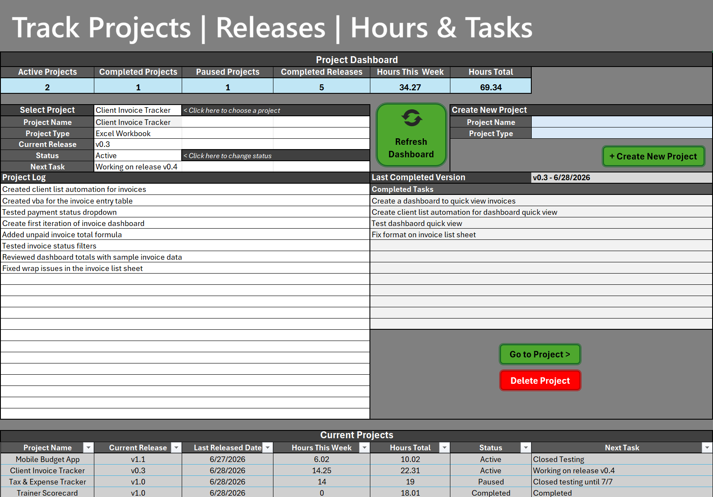
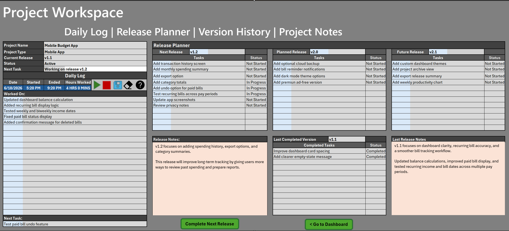
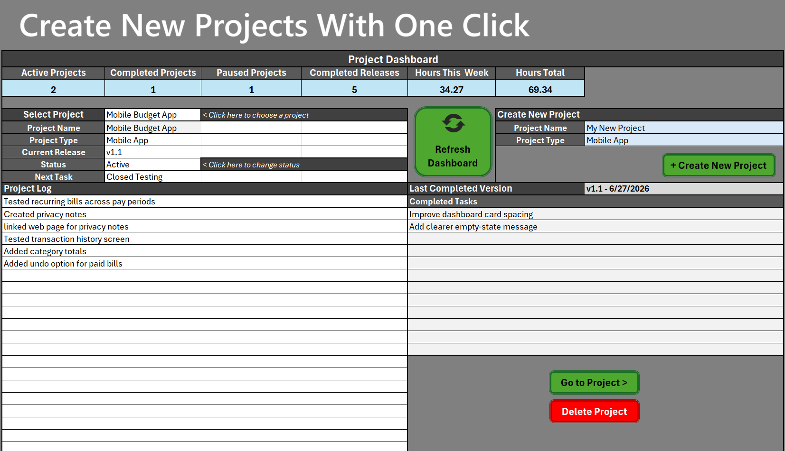

# Automated Project Tracker
**Automated Project Tracker** is a macro-enabled Excel workbook designed to help users manage projects, tasks, releases, notes, and version history from one organized dashboard.

Instead of using separate files for planning, task lists, release notes, and project logs, this workbook brings those pieces together into one automated project management system built directly in Microsoft Excel.

---

## What This Workbook Does

The Automated Project Tracker helps users:

- Create and manage multiple projects
- Track active project tasks
- Organize tasks by status, priority, and phase
- Record release versions and release notes
- Keep project-specific notes and brainstorming ideas
- Review current project progress from a central dashboard
- Maintain a simple history of completed releases

The workbook is designed for people who want structure without needing a full project management platform.

---

## Main Features

### Central Dashboard

The dashboard gives users a high-level view of their projects. It is designed as the main control center of the workbook.

From the dashboard, users can review active projects, see project information, and navigate into the project workspace.

---

### Automated Project Creation

Users can create a new project without manually copying sheets or rebuilding the workbook layout.

The tracker generates a new project workspace so each project has a consistent structure. This makes it easier to manage multiple projects while keeping everything organized.

---

### Project Workspace

Each project has its own workspace where users can manage the details of that specific project.

The workspace includes areas for:

- Project information
- Current tasks
- Task status
- Task priority
- Project phase
- Release planning
- Release notes
- Brainstorming notes
- Development notes

This gives each project a dedicated place for both planning and execution.

---

### Task Tracking

The task tracker helps users break down work into manageable pieces.

Tasks can be organized by:

- Task name
- Status
- Priority
- Phase
- Notes or details

This makes the workbook useful for tracking progress across different types of projects, whether the user is building a product, managing a small business project, planning content, or organizing personal work.

---

### Release and Version Tracking

The workbook includes a release tracking section so users can document completed versions of a project.

Users can record:

- Version names
- Release dates
- Completed release notes
- Current release notes
- Last completed version details

This is especially useful for software projects, digital products, templates, creative projects, or any project that improves over time through multiple versions.

---

### Project Notes and Brainstorming

The workbook includes space for project notes, brainstorming, and planning ideas.

This allows users to keep important thoughts inside the same workbook instead of spreading them across separate documents, sticky notes, or notebooks.

---

## Who This Is For

This workbook is useful for:

- Creators managing digital products
- Developers tracking app or software progress
- Freelancers organizing client projects
- Students managing assignments or capstone projects
- Small business owners planning internal projects
- Etsy sellers managing product updates
- Anyone who wants a structured project tracker inside Excel

---

## Why I Built It

I built this workbook because I wanted a practical way to manage multiple projects without jumping between different apps.

I needed something that could track project tasks, notes, releases, and progress in one place while still being simple enough for everyday use.

The goal was to make an Excel workbook that feels closer to a lightweight project management app than a basic spreadsheet.

---

## How It Works

The user starts from the dashboard, creates or selects a project, and then works inside that project’s workspace.

A typical workflow looks like this:

1. Create a new project
2. Add project details
3. Add tasks
4. Update task status and priority
5. Track progress through project phases
6. Write notes or brainstorm ideas
7. Record release notes
8. Complete a release/version
9. Review project history and continue improving the project

---

## Built With

- Microsoft Excel
- VBA Macros
- Excel Tables
- Structured worksheets
- Custom dashboard layout
- Automated workbook navigation and project creation

---

## Current Version

**Version:** 1.0

The current version focuses on the core project tracking workflow:

- Dashboard
- Project workspace
- Task tracking
- Release tracking
- Notes sections
- Automated project creation
- Basic project organization

---

## Future Improvements

Planned or possible future updates include:

- Expanded dashboard metrics
- Better project history views
- Archived project tracking
- More release log details
- Additional automation
- More reporting options
- Optional templates for different project types

---

## About This Project

The Automated Project Tracker is part of **Tiny Rebellion Studios**, a personal creative and software brand focused on building useful tools, productivity systems, apps, and games.

A customer-ready version of this workbook is available here:

[Automated Excel Project Tracker on Etsy](https://www.etsy.com/listing/4529548538/automated-excel-project-tracker)

---

## Author

Created by **July Wellman**
